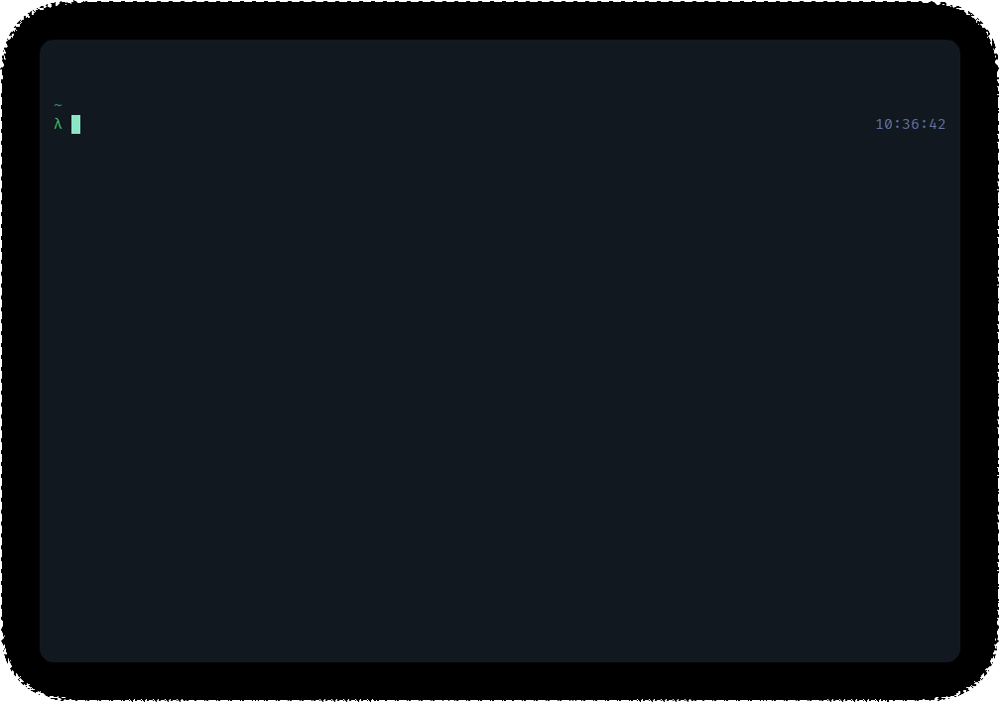

# ttyper

[](https://crates.io/crates/ttyper)
[](https://github.com/max-niederman/ttyper)
[](https://github.com/max-niederman/ttyper/actions)
[](https://github.com/max-niederman/ttype/github/actions/workflow/status/:user/:repo/:workflow+r/issues)
[](./LICENSE.md)

ttyper is a terminal-based typing test built with Rust and tui-rs.



## installation

### pre-built binaries

Pre-built binaries are available for most architectures on [GitHub releases](https://github.com/max-niederman/ttyper/releases). If your system is not supported or you have another problem, feel free to open an issue.

### cargo

```bash
cargo install ttyper
```

### scoop

```bash
scoop install ttyper
```

## usage

For usage instructions, you can run `ttyper --help`:

```
ttyper 1.4.0
Terminal-based typing test.

USAGE:
    ttyper [FLAGS] [OPTIONS] [contents]

FLAGS:
    -d, --debug             
    -h, --help              Prints help information
        --list-languages    List installed languages
        --no-backtrack      Disable backtracking to completed words
    -V, --version           Prints version information

OPTIONS:
    -c, --config <config>                  Use config file
    -l, --language <language>              Specify test language
        --language-file <language-file>    Specify test language in file
    -w, --words <words>                    Specify word count [default: 50]

ARGS:
    <contents>
```

### examples

| command                        |                             test contents |
| :----------------------------- | ----------------------------------------: |
| `ttyper`                       |   50 of the 200 most common english words |
| `ttyper -w 100`                |  100 of the 200 most common English words |
| `ttyper -w 100 -l english1000` | 100 of the 1000 most common English words |
| `ttyper --language-file lang`  |      50 random words from the file `lang` |
| `ttyper text.txt`              |  contents of `text.txt` split at newlines |

## languages

The following languages are available by default:

| name               |                         description |
| :----------------- | ----------------------------------: |
| `c`                |          The C programming language |
| `csharp`           |         The C# programming language |
| `english100`       |       100 most common English words |
| `english200`       |       200 most common English words |
| `english1000`      |      1000 most common English words |
| `english-advanced` |              Advanced English words |
| `english-pirate`   |       50 pirate speak English words |
| `german`           |        207 most common German words |
| `german1000`       |       1000 most common German words |
| `german10000`      |      10000 most common German words |
| `go`               |         The Go programming language |
| `html`             |           HyperText Markup Language |
| `java`             |       The Java programming language |
| `javascript`       | The Javascript programming language |
| `norwegian`        |     200 most common Norwegian words |
| `php`              |        The PHP programming language |
| `portuguese`       |    100 most common Portuguese words |
| `python`           |     The Python programming language |
| `qt`               |                The QT GUI framework |
| `ruby`             |       The Ruby programming language |
| `rust`             |       The Rust programming language |
| `spanish`          |       100 most common Spanish words |
| `ukrainian`        |     100 most common Ukrainian words |

Additional languages can be added by creating a file in `TTYPER_CONFIG_DIR/language` with a word on each line. On Linux, the config directory is `$HOME/.config/ttyper`; on Windows, it's `C:\Users\user\AppData\Roaming\ttyper`; and on macOS it's `$HOME/Library/Application Support/ttyper`.

## config

Configuration is specified by the `config.toml` file in the config directory (e.g. `$HOME/.config/ttyper/config.toml`).

The default values with explanations are below:

```toml
# the language used when one is not manually specified
default_language = "english200"

[theme]
# default style (this includes empty cells)
default = "none"

# title text styling
title = "white;bold"

## test styles ##

# input box border
input_border = "cyan"
# prompt box border
prompt_border = "green"

# correctly typed words
prompt_correct = "green"
# incorrectly typed words
prompt_incorrect = "red"
# untyped words
prompt_untyped = "gray"

# correctly typed letters in current word
prompt_current_correct = "green;bold"
# incorrectly typed letters in current word
prompt_current_incorrect = "red;bold"
# untyped letters in current word
prompt_current_untyped = "blue;bold"

# cursor character
prompt_cursor = "none;underlined"

## results styles ##

# overview text
results_overview = "cyan;bold"
# overview border
results_overview_border = "cyan"

# worst keys text
results_worst_keys = "cyan;bold"
# worst keys border
results_worst_keys_border = "cyan"

# results chart default (includes plotted data)
results_chart = "cyan"
# results chart x-axis label
results_chart_x = "cyan"
# results chart y-axis label
results_chart_y = "gray;italic"

# restart/quit prompt in results ui
results_restart_prompt = "gray;italic"
```

### style format

The configuration uses a custom style format which can specify most [ANSI escape styling codes](<https://en.wikipedia.org/wiki/ANSI_escape_code#SGR_(Select_Graphic_Rendition)_parameters>), encoded as a string.

Styles begin with the color specification, which can be a single color (the foreground), or two colors seperated by a colon (the foreground and background). Colors can be one of sixteen specified by your terminal, a 24-bit hex color code, `none`, or `reset`.

After the colors, you can optionally specify modifiers seperated by a semicolon. A list of modifiers is below:

- `bold`
- `crossed_out`
- `dim`
- `hidden`
- `italic`
- `rapid_blink`
- `slow_blink`
- `reversed`
- `underlined`

Some examples:

- `blue:white;italic` specifies italic blue text on a white background.
- `none;italic;bold;underlined` specifies underlined, italicized, and bolded text with no set color or background.
- `00ff00:000000` specifies text of color `#00ff00` (pure green) on a background of `#000000` (pure black).

In [extended Backus-Naur form](https://en.wikipedia.org/wiki/Extended_Backus%E2%80%93Naur_form):

```ebnf
style     = colors, { ";", modifier }, [ ";" ] ;

colors    = color, [ ":", color ] ;
color     = "none"
          | "reset"
          | "black"
          | "white"
          | "red"
          | "green"
          | "yellow"
          | "blue"
          | "magenta"
          | "cyan"
          | "gray"
          | "darkgray"
          | "lightred"
          | "lightgreen"
          | "lightyellow"
          | "lightblue"
          | "lightmagenta"
          | "lightcyan"
          | 6 * hex digit ;
hex digit = ? hexadecimal digit; 1-9, a-z, and A-Z ? ;

modifier  = "bold"
          | "crossed_out"
          | "dim"
          | "hidden"
          | "italic"
          | "rapid_blink"
          | "slow_blink"
          | "reversed"
          | "underlined" ;
```

If you're familiar with [serde](https://serde.rs), you can also read [the deserialization code](./src/config.rs).
