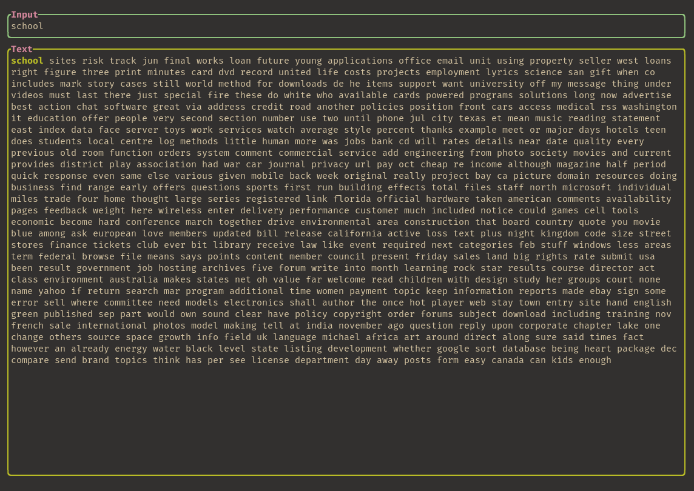

# ttyper

Ttyper is a terminal-based typing test built with Rust and tui-rs.



## installation

With Cargo:

```bash
cargo install ttyper
```

## to-do

- Fix weirdness with the WPM calculation.
- Use per-word frequency data for more realistic tests.
- Add keywise data to the results UI for "improvement tips."
- Add WPM graph to results UI.
